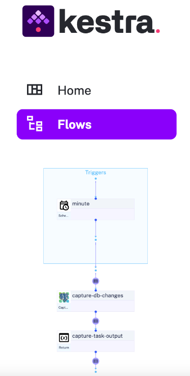

# kestra-poc

The PoC consisted in testing Kestra capabilities to stream near real-time data to booking analytics dashboard using CDC. Further points evaluated consisted in product reliability and scalability accounting a possibility of Production implementation.

Components being used in the tests:

- Kestra https://kestra.io/
- Built-in Debezium PSQL connector https://kestra.io/plugins/plugin-debezium-postgres
- Local Postgres instance 

The test case was constructed as per the following workflow:

 

Test case

- Execute a Kestra Flow previously created using YAML format Flows 
- Grab the results from the booking table with no dummy data injected
- Perform a manual DB insert simulating a live booking
- The logic waits one minute before executing a new Kestra flow in a batch based sauce  
- New data is retrieved by the connector returning data to standard output
- The comparison between the data grabbed from point 2 to point 5 shows the actual booking data increases
- The Trigger function from DebeZium connector Trigger  allows to send changes to further steps → Eg:
- SQS queue Publish 
  - A custom Lambda function would consume from the SQS topic 
  - Define some custom logic (if needed)
  - send to Elastic using python elasticsearch Library
  - An ECS Fargate Task
- Directly send data to Elastic using custom Kestra plugin Put 
- Data would reflect in the backed within a Kibana dashboard for booking analytics
 

Topology

 

Outcome

After configuring a Kestra flow with the Debezium plugin, the connector successfully established a connection to the PostgreSQL instance, leveraging Change Data Capture (CDC) capabilities. Further details can be found at Debezium connector for PostgreSQL :: Debezium Documentation .
The refreshed data was accurately retrieved for subsequent processing. Overall, the setup was streamlined, and the user interface support facilitated rapid creation of tenant-specific flows, allowing for scalability based on actual requirements.
Ultimately, the results aligned well with our initial expectations. This appears to be a robust product backed by a strong open-source community, offering multiple integrations for diverse use-cases .

 

Community resources

- GitHub - kestra-io/kestra: Kestra is an infinitely scalable orchestration and scheduling platform, creating, running, scheduling, and monitoring millions of complex pipelines. 

